# Operance
Operance is a debugging simulation platform that drops users into a realistic cloud engineering environment with a broken CI pipeline, live backend services, and an AI debug coach. 

It tracks how the user investigates and resolves the failure, then scores their performance based on time, efficiency, and decision-making throughout the session.

Companies could use it as a prerequisite certification for job applicants, with each environment tailored to the specific role and stack of the position they are hiring for.

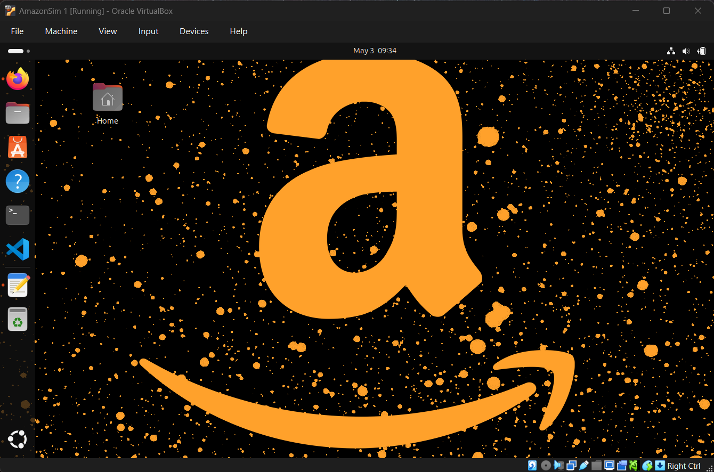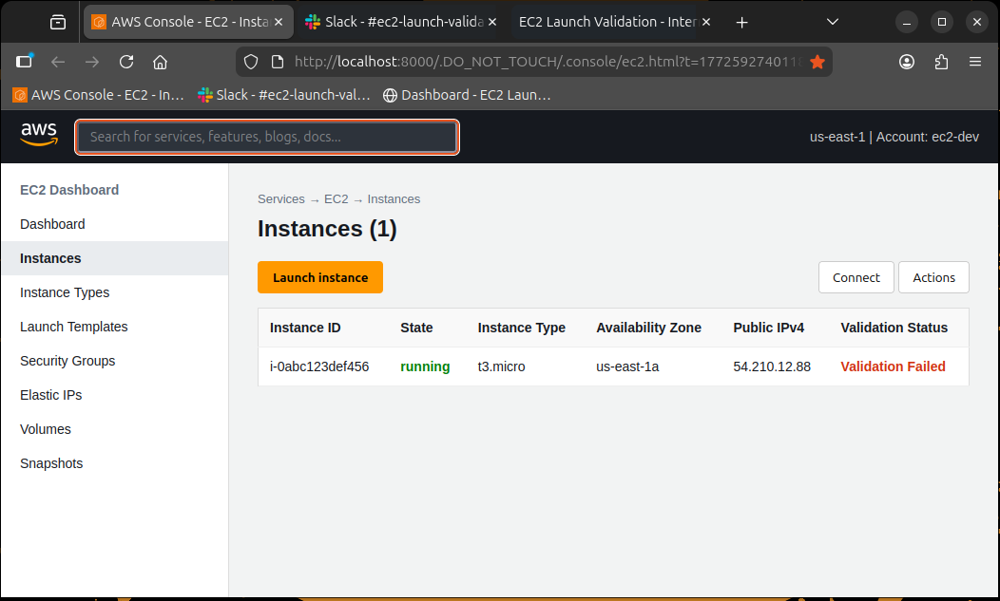

## Note
This is a very prototypical version of Operance that was developed for the Amazon Nova AI Hackathon. Only the *Amazon -> Software Engineer -> EC2 Worker* training environment has been developed so far. Scaling Operance would mean adding more companies as well as their respective fields and positions, such as Cybersecurity roles/training environments.

_Even though this project was developed for the hackathon, we didn't end up submitting it to the hackathon_


## Features
- CI pipeline simulation using pytest and shell scripting
- Slack-style failure logging rendered in HTML
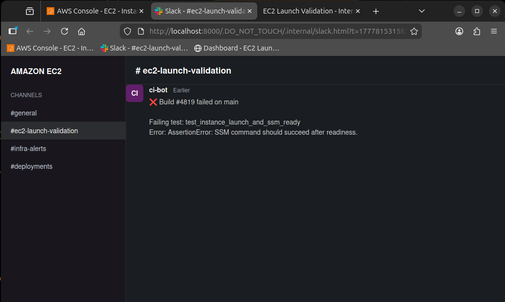 

- AI chat window backed by Amazon Nova (via Bedrock runtime)
- Screen capture loop that feeds context into the AI
- Scenario-based backend bugs (for example EC2 validation logic)
- Automated grading through an external API
- Time tracking and session metrics
## How It Works
1. User clicks Start Session
- This triggers a backend endpoint that resets the session and starts the timer
2. The AI debug window activates
- This is a Nova-based assistant connected through Bedrock
- It continuously receives screen captures from the environment
- It's preloaded with the specific scenario context and relevant files
3. The AI monitors user behavior in real time
- Detects what the user is doing based on screen content
- Tracks progress through expected steps
- Identifies when the user reaches key checkpoints
4. The AI provides guidance and enforcement
- Gives hints when the user is stuck or taking too long
- Responds to direct questions about the scenario
- Automatically flags incorrect actions
- Warns the user if they are working in the wrong place
- Repeated incorrect behavior can affect scoring
5. User runs the CI pipeline

```
./run_ci.sh
```
- Runs integration tests
- Outputs logs and failure messages
- Updates Slack-style UI
- Writes status to `ci_status.json`

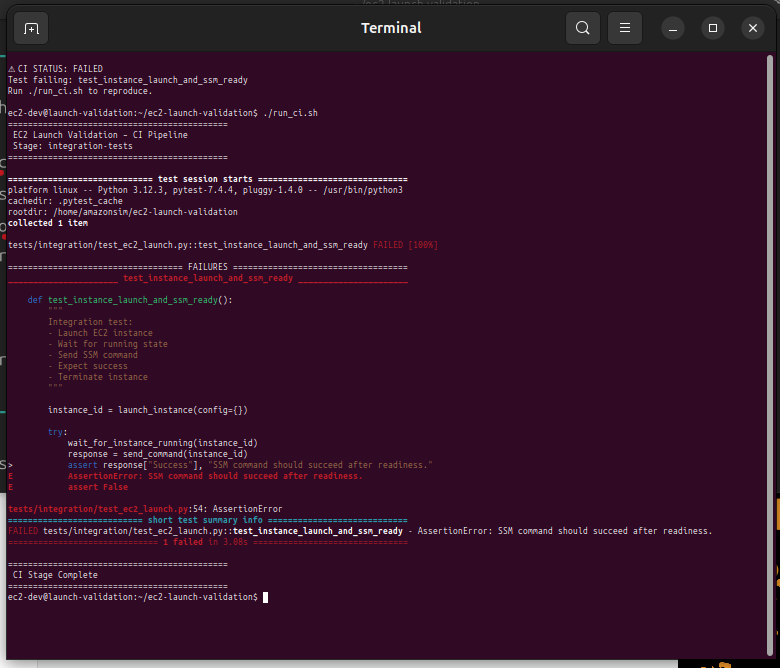

6. User investigates and fixes the issue
- Uses logs, test files, and backend code
- Applies fix and re-runs CI

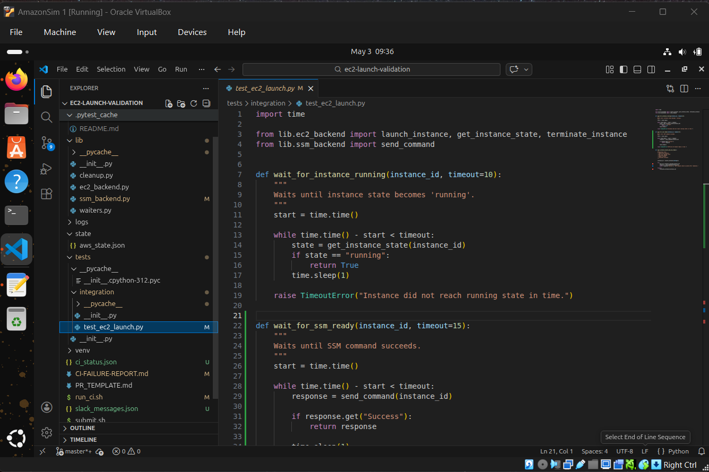

7. CI passes
- System detects success through `ci_status.json`
- Submission is sent to the grading API
8. Score is calculated using multiple signals
- Whether the test was successfully fixed
- Total time from Start Session
- Number of interactions with the AI
- AI analysis of the entire session (behavior, decisions, mistakes)
9. Results are posted to the dashboard
- Includes score breakdown and feedback
- Accessible through the results site
## AI Debug Window
The AI chat window is a wrapper around Amazon Nova (Bedrock runtime).
- Sends user messages along with current screen capture
- Injects relevant file context:
  - `CI-FAILURE-REPORT.md`
  - backend files
  - test files
- Maintains conversation history
- Responds with short, direct guidance

The AI does not expose solutions. It only answers what is asked.

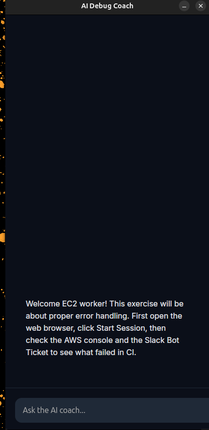
## Grading System

After CI passes, run_ci.sh sends a POST request to a grading API.

Current temporary endpoint:

[operance-nova-hackathon.vercel.app](https://operance-nova-hackathon.vercel.app)

Submission includes:
```
tasks_completed
time_taken_seconds
scenario_type
notes
```
The API is backed by AWS Lambda and returns structured feedback:
- overall score
- dimension breakdown
- summary
- recommendations

The final score is not based on CI success alone. It is calculated using multiple signals:
- whether the test was successfully solved
- total time from Start Session to CI pass
- number of interactions with the AI
- behavior observed during the session

The AI debug window continuously monitors the session and builds a behavioral trace of the user’s actions. This includes:
- whether the user followed expected debugging steps
- time spent in relevant vs irrelevant files
- repeated incorrect actions or warnings
- reliance on hints or guidance

This analysis is combined with time and completion status to produce the final score.

Example:
```
Task Completion: 100
Efficiency: 90
Scenario Handling: 85
CI Pipeline Performance: 100
```
## Where to See Results
Results are available at:

[operance-nova-hackathon.vercel.app](https://operance-nova-hackathon.vercel.app)

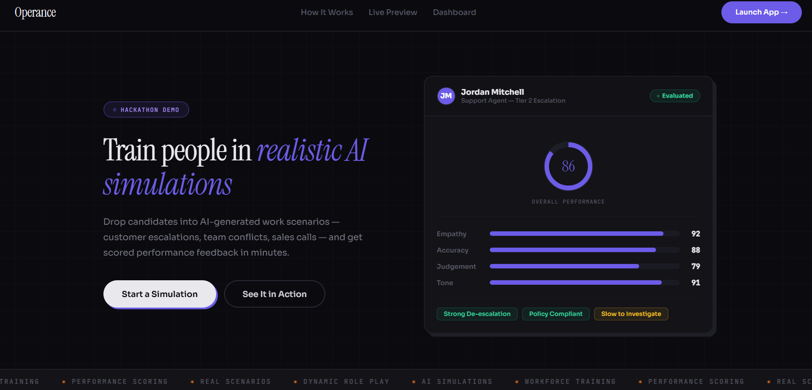

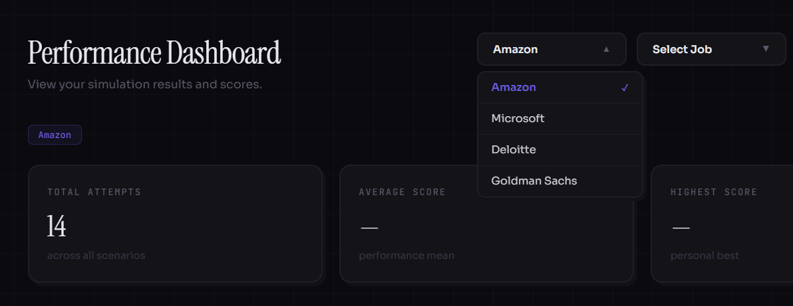

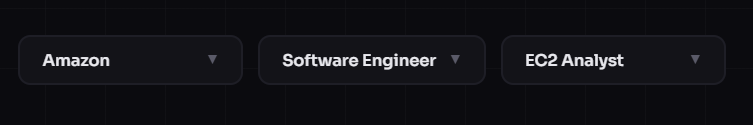

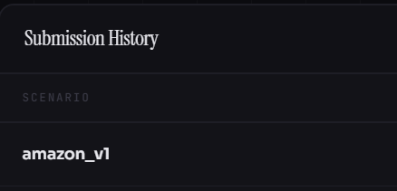

Each submission is logged with:
- timestamp
- scenario
- score breakdown
- summary

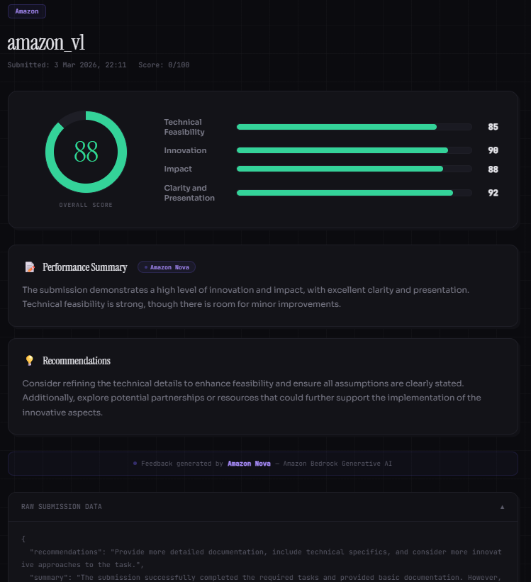

## Environment Design  Structure
```
Operance/
│
├── coach_engine.py
├── run_ci.sh
├── launch_ai.py
│
├── lib/
│   └── ec2_backend.py
│
├── tests/
│   └── integration/
│       └── test_ec2_launch.py
│
└── CI-FAILURE-REPORT.md
```
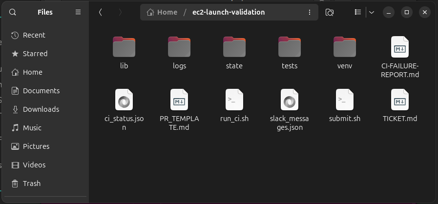
## Running Tests
Run the CI pipeline:
```
./run_ci.sh
```
Outputs:
- test results
- CI status file
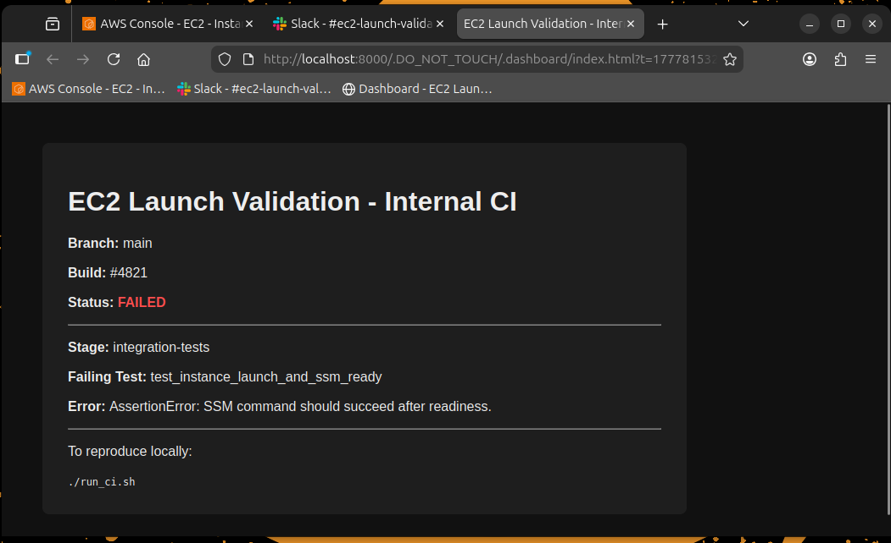

- Slack UI updates


- dashboard submission
## Tech Stack
`Python (Flask, pytest)`

`Bash (CI simulation)`

`Amazon Bedrock (Nova model)`

`AWS Lambda (grading API)`

`HTML (Slack UI rendering)`

`X11 screen capture`

## Installation (Windows Only)

### Requirements

- Virtualization must be enabled. Instructions can be found at https://support.microsoft.com/en-us/windows/enable-virtualization-on-windows-c5578302-6e43-4b4b-a449-8ced115f58e1
- CPU: 2 cores minimum, 4 cores recommended
- RAM: 4 GB minimum, 8 GB recommended
- Storage: 5 GB available space

### 1. Download these files from the repository and place them into a folder:
**DOWNLOAD** `env1.ova` **FROM THE GOOGLE DRIVE LINK IN** `env1.ova.md`)
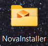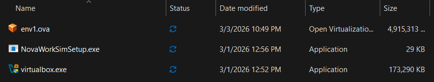

### 2. Right-click on `NovaWorkSimSetup.exe` and click `Run as Administrator`. Allow permissions for the pop-up
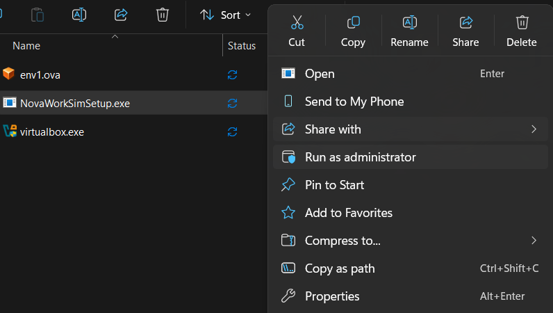

### 3. A Command Prompt tab will open. It will review if you have the required specs and dependencies. If you do not have the dependencies, it will automatically download them for you.
Dependencies:
- Latest version of VC++ Redistributable
- pip
- pywin32
- python or python3
- VirtualBox

### After, it will say `Importing OVA...`. It may remain on this for a few minutes. Here is where the minimum spec check will occur. 
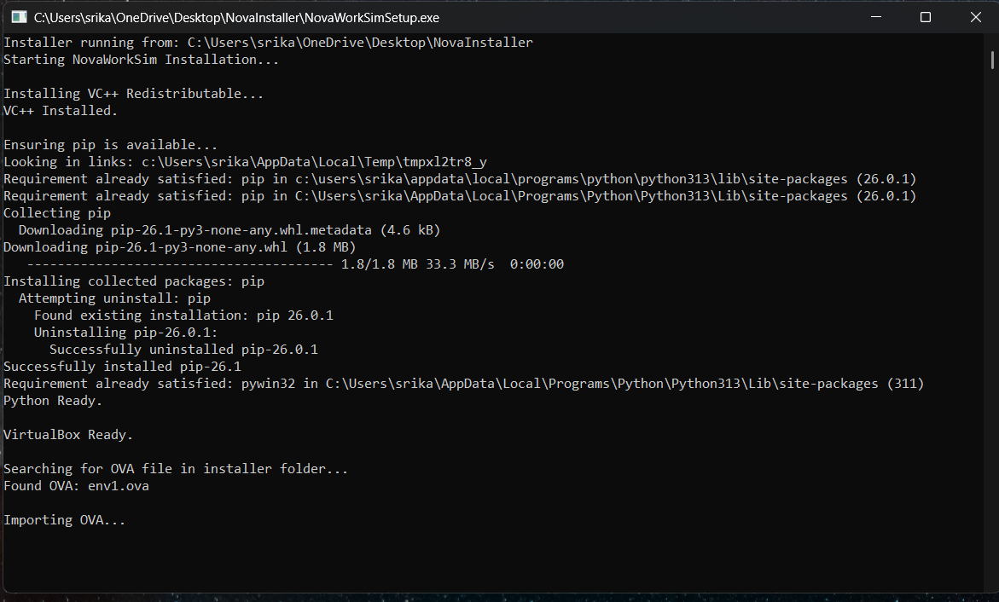

### Eventually, you should see this:
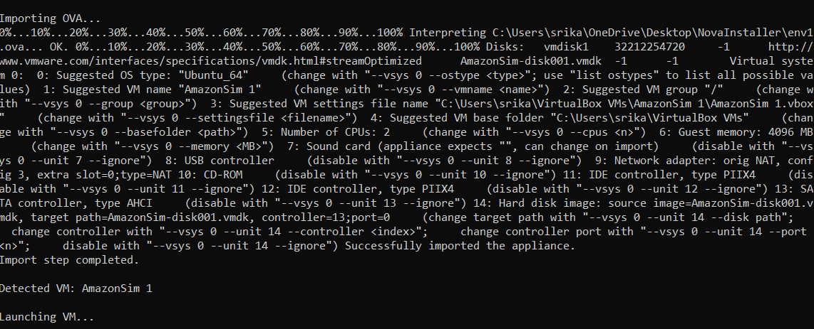

### Press `Emter` with the CMD window highlighted to close it, and the training environment should be active in another window.
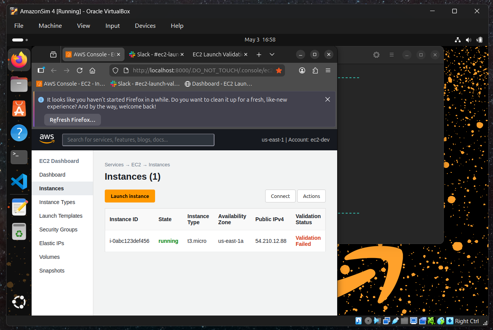
  
## Example Scenario
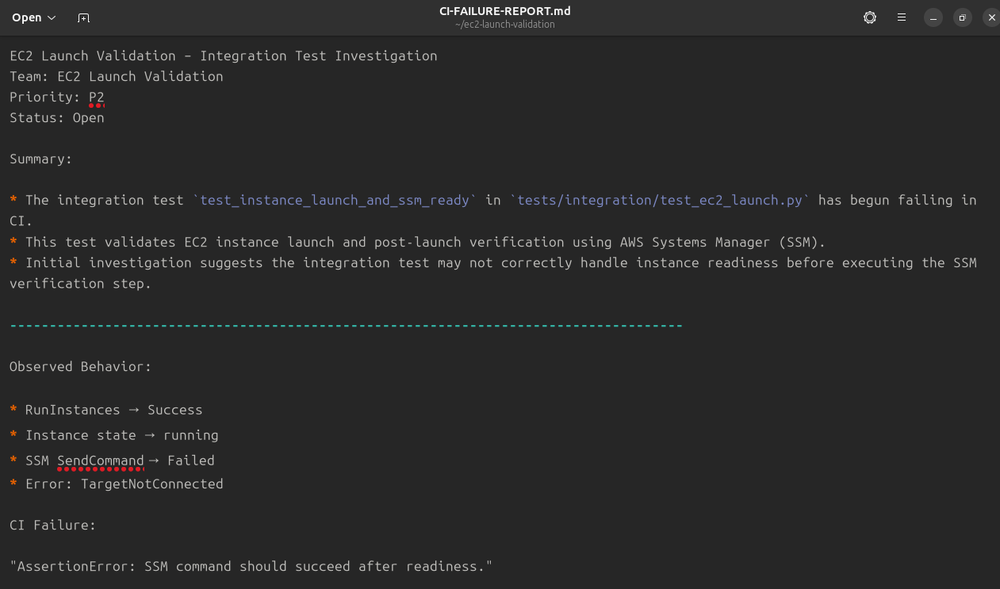

EC2 Launch Validation – Integration Test Investigation
Team: EC2 Launch Validation
Priority: P2
Status: Open

Summary:

* The integration test `test_instance_launch_and_ssm_ready` in `tests/integration/test_ec2_launch.py` has begun failing in CI.
* This test validates EC2 instance launch and post-launch verification using AWS Systems Manager (SSM).
* Initial investigation suggests the integration test may not correctly handle instance readiness before executing the SSM verification step.

-------------------------------------------------------------------------------------

Observed Behavior:

* RunInstances → Success
* Instance state → running
* SSM SendCommand → Failed
* Error: TargetNotConnected

CI Failure:

"AssertionError: SSM command should succeed after readiness."

-------------------------------------------------------------------------------------

Expected Test Behavior

The test should:

[] Launch an EC2 instance using a valid configuration

[] Wait for the instance to reach running state

[] Verify the instance is reachable via SSM

[] Execute a verification command through SSM

[] Assert successful command execution

[] Terminate the instance after validation

[] Ensure no residual resources remain

-------------------------------------------------------------------------------------

Assignment:

Investigate the failing integration test and restore stability.

* Backend simulation code is functioning correctly and should not be modified.
* The failure originates from the integration test located in `tests/integration/test_ec2_launch.py`.
* Review the test workflow and ensure it properly waits for instance readiness before verifying SSM command execution.
* Use `./run_ci.sh` from the repository root to execute the CI integration test locally while investigating the failure.

-------------------------------------------------------------------------------------

Success Criteria

[] Root cause identified

[] Integration test logic corrected

[] Test passes consistently across multiple runs

[] No flakiness introduced

[] All resources properly cleaned up
## Notes
- Timer should start from Start Session, not CI execution
- AI relies on screen context and prompt injection, not direct file execution
